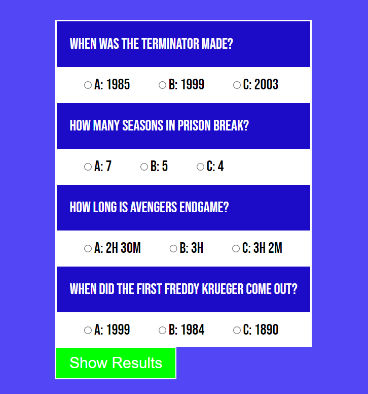
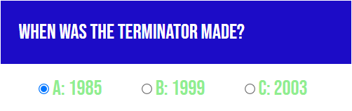
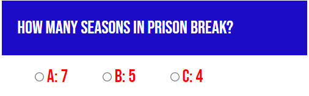

# Muiz

Muiz is a site that allows users to play a simple Movie Quiz. The site will be targeted toward everyone who is looking for a way to play a simple game.

## Features 

### Questions - 

The users is shown four options of movie questions to answer as they wish.

### Answer Display

The user will be able to pick between three options A, B and C in the answer boxes.

### Show Results Button

To show if the user has chosen the correct answers the user can click on the Show Results button.

### Chose Correct 

When the user has chosen a correct answer the answer text will then appear green to indicate that the answer they chosen is correct.

### Chose Wrong

When the user has chosen a wrong answer the answer text will then appear red to indicate that the answer they chosen is wrong.

### Results

After selecting all the answers and clicking on the Show Results button a score will appear indicating the users score.

## Testing

Testing was a diffucult task but I was able to bring Muiz to life by the help of the Student Care team and [W3Schools](https://www.w3schools.com/js/).

## Deployment
The site was deployed to GitHub pages. The steps to deploy are as follows:
* In the GitHub repository, navigate to the Settings tab
* From the source section drop-down menu, select the Master Branch
* Once the master branch has been selected, the page will be automatically refreshed with a detailed ribbon display to indicate the successful deployment.

## Credits 

[W3Schools](https://www.w3schools.com/js/) helped me with the majority of the JavaScript code.